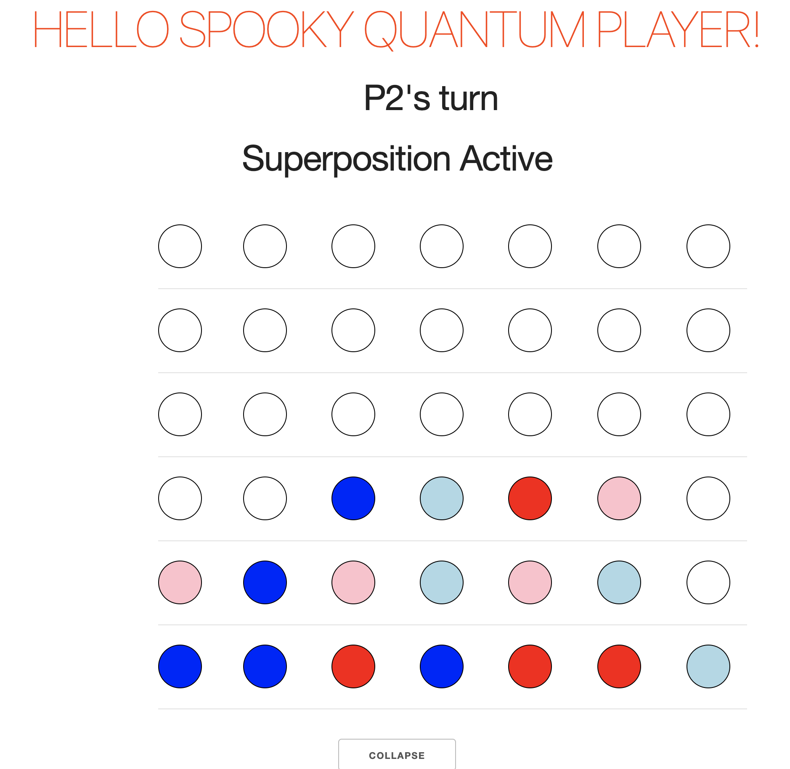
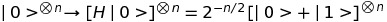
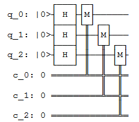
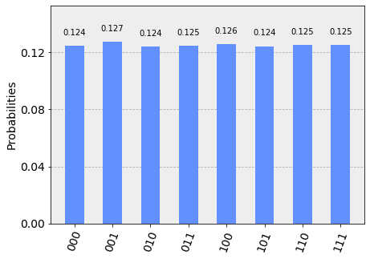

# [Quantum Connect Four](https://quantum-connect-four.herokuapp.com/)

## About

This web based game is a submission for the IBM Quantum Awards 2019 the Game Award Challenge.

This game is based on the tabletop game [Connect Four](https://en.wikipedia.org/wiki/Connect_Four) and also inspired by the popular [Quantum Tic Tac Toe](http://quantumtictactoe.com).

However Connect Four differs from Tic Tac Toe in that the pieces are placed from the top and fall to the bottom under the influence of gravity.

## Contributors

- Arjit Khullar [@arjitkhullar](https://github.com/arjitkhullar)
- Tomisin Jenrola [@ToJen](https://github.com/ToJen)
- Rahul Choudary [@YenSid12](https://github.com/YenSid12)

## How To Play

The players take turns dropping different colored pieces into columns until they can form a horizontal, vertical or diagonal line of 4 pieces. Instead of placing these classical ('solid') pieces, players can also form quantum superpositions by clicking the 'Begin Superposition' button and placing two quantum pieces (indicated by a lighter shade) in different spots, such that the piece has a 50% chance of appearing in either spot upon quantum measurement. Forming superpositions with quantum pieces serves the additional purpose of denying crucial squares to opponents. Both sides continue placing solid or quantum pieces until the the board is filled up, at which point, the superpositions collapse and the surviving pieces fall into place under the influence of gravity and the game-play resumes.

The game will continue like this until any one of the following conditions is met:

1. Player 1 forms a winning combo before their opponent. Note: the winning pieces must be solid and must not have any shaky quantum pieces underneath them, since that could potentially destroy a winning connection upon quantum measurement.
2. Player 2 forms a winning combo before their opponent
3. Tie I: The board gets completely filled up by solid pieces before either player can form a winning combo thereby ending in a draw
4. Tie II: Both players form winning combos simultaneously upon collapse of the superpositions, this is a draw condition unique to our quantum version of Connect Four

### Here's a sneak peak

## Math Behind It

To collapse n-pairs of superposed pieces all at once, we first map a qubit to each pair of superposed pieces. Then we create a equally weighted superposition of all 2^n states by applying Hadamard gates to every qubit:

#### Gate

We then measure the state and collapse the game board accordingly. The plots below are from a 3-qubit example of our circuit, performed on the qasm_simulator of the Aer package:

#### The Quantum Circuit

#### Histogram of A Generated Circuit

## Developing Using Docker (Recommended)

1. Clone this repo: `git clone git@github.com:ToJen/quantum-connect-four.git`
2. `docker-compose up --build --force-recreate --always-recreate-deps`

## Manually

1. Clone this repo: `git clone git@github.com:ToJen/quantum-connect-four.git`
2. `cd client`
3. `yarn && yarn dev`
4. Create a separate terminal session
5. `cd server`
6. `pip install -r requirements.txt`
7. `python main.py` (Python 3.5.7)

Visit <http://localhost:5000>

## Deploying to Heroku

1. `docker build -t registry.heroku.com/<heroku-app-name>/web . && docker push registry.heroku.com/<heroku-app-name>/web && heroku container:release web -a <heroku-app-name>`
